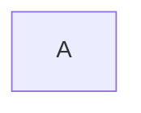
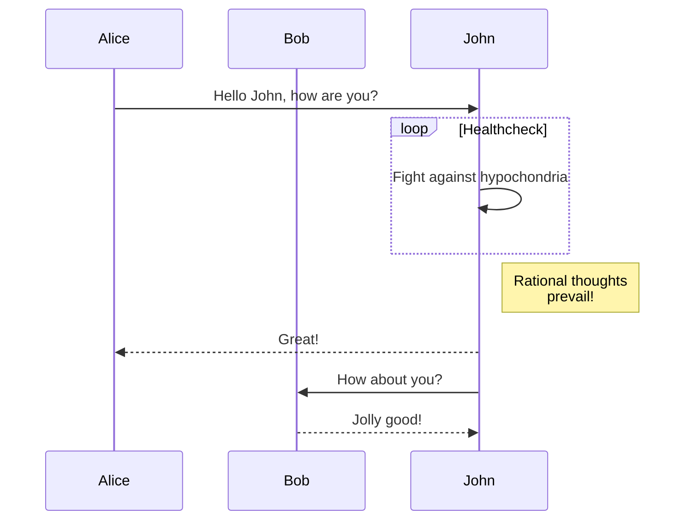
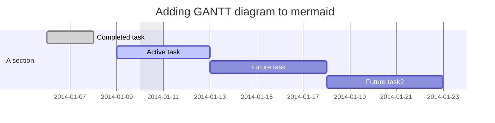
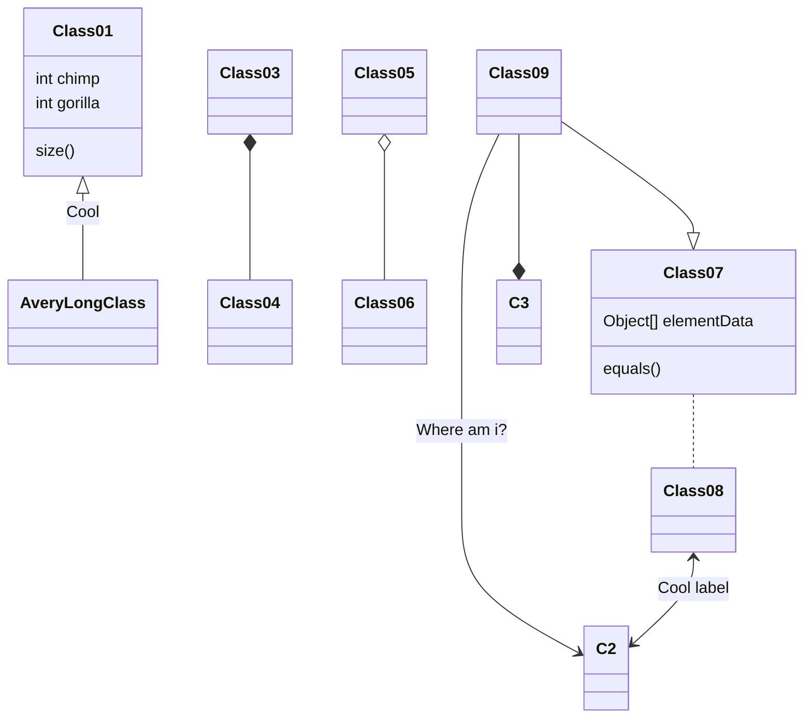
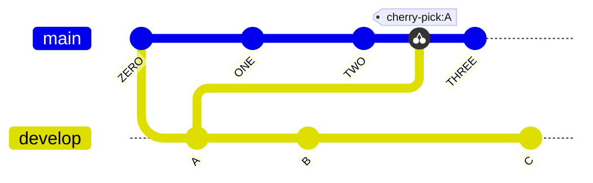
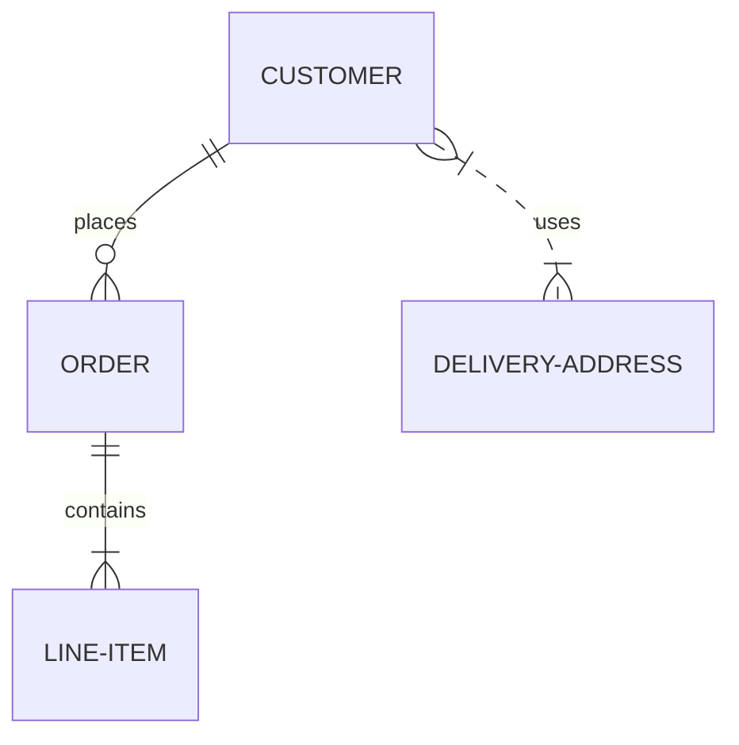
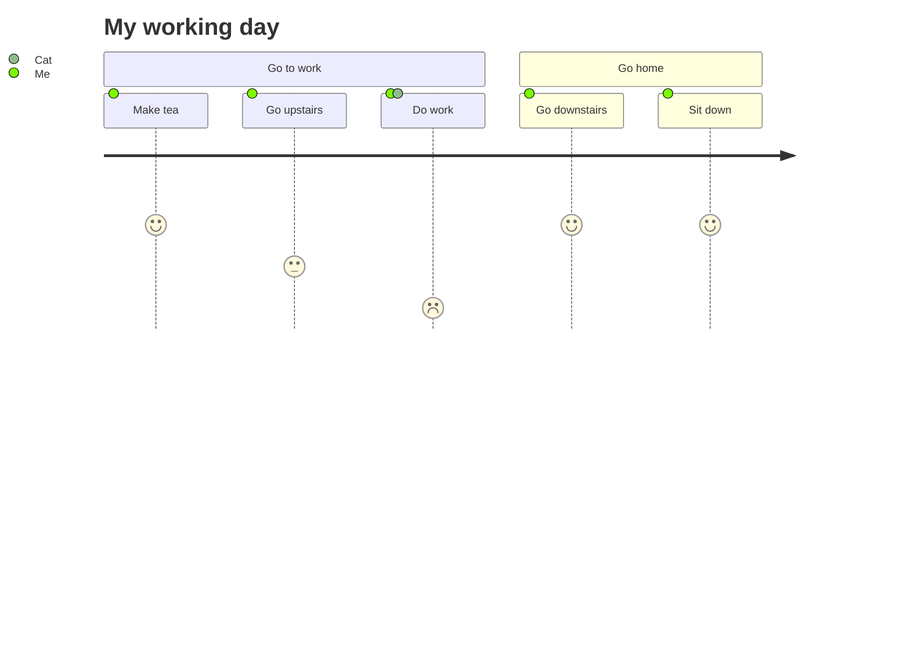

## Simple Flowchart

---

## Flowchart

---

## Sequence diagram

---

## Gantt diagram

---

## Class diagram

---

## Git graph

---

## Entity Relationship Diagram

---

## User Journey Diagram

